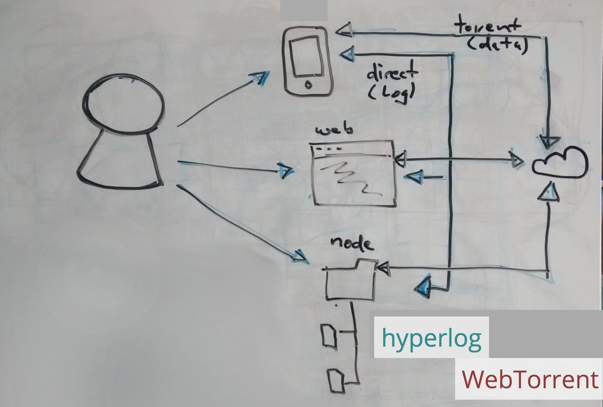

# blob-stream

> A choo, hyperlog, webtorrent experiment: sync images peer-to-peer.



## Web mode

```sh
npm install
npm start
```

Then go to [localhost:9966](http://localhost:9966). Open two instances of the page. In one of them use the file picker to add an image. Wait a few seconds for both instances to synchronize.

## Native mode ("legacy mode")

```sh
npm install
cd legacy
npm install
cd ..
npm run legacy
```

The script will then create a `./blob-stream` folder. Images added to that folder will be synced with other instances of blob-stream. Browser mode can be run simultaneously. Images that are added via browser instances will be synced into this folder and a system notification will be displayed (MacOS recent).

Local state can be reset via: `rm -rf legacy/ephemeral/known_files.db legacy/ephemeral/hyperlog_state/`

## Various

- [My presentation slides](https://slides.com/pguth/blob-stream/)
